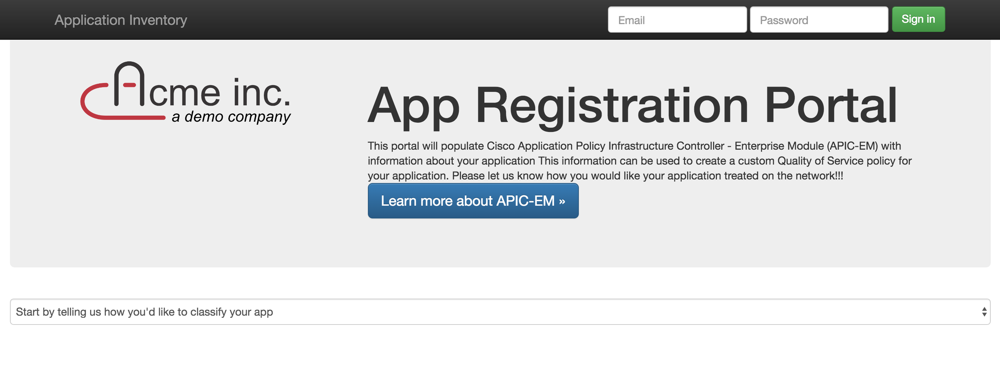

# appregistry

This is a simple frontend for APIC-EM which allows business owners to register applications in a portal
with a minimal amount of technical details about the application, and transfer that information to APIC-EM to be
consumed in EasyQos policies



# Configuration

Set the following environment variables, if not set, these will default to the APIC-EM sandbox on DevNet.


```
export APIC_URL=https://myapic.com
export APIC_USER=admin
export APIC_PASSWORD=supersecret
```

Additionally, if you would like notifications on Cisco Spark when applications get registered, add the following

```
export SPARK_TOKEN=<SPARK TOKEN>
export SPARK_ROOM=<id of spark room>
```

If you are using the DevNet Sanbox, you can login to see the changes pushed by this application at:
https://sandboxapic.cisco.com/


# Running

## Locally

#### Install dependencies
    virtualenv venv
    source venv/bin/activate
    pip install -r requirements.txt

#### Run
    python app.py

## Docker

Perhaps the simplest way to run this application is via Docker, simply modify the values
in [./ENVIRONMENT](./ENVIRONMENT) and run the following command

    docker run -p 5000:5000 --env-file ENVIRONMENT imapex/appregistry

## CiscoShipped.io

You can also deploy this application on Cisco Shipped, simply fork this repo, create a new application in Cisco Shipped,
and add this repository as a service. **Don't forget to add your enviornment variables to your deploy target**

# Customization / Branding

This app also allows for quick customizations, you can change the title of the page as well as the logo image
to suit your demonstration.

    export TITLE = "My company name"
    export LOGO = "http://location.for/mylogo.jpg"

